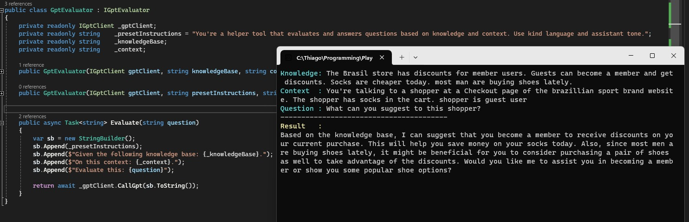

# SimpleGPT.Core
Simplistic library for adding ChatGPT in your application for problem solving and context evaluation/recommendation. Uses OpenAI's GPT APIs

## Basic Clients
There are two basic clients for the Chat and Completions OpenAI APIs respectively

The **ChatGptClient** and the **GptCompletionsClient**
```csharp
using SimpleGPT.Core;

const string GPT_API_KEY = "< api-key-here >";
var chatGpt = new ChatGptClient(Shared.ModelNames.Gpt4Turbo, GPT_API_KEY);

chatGpt.AddChatMessage(ChatMessageType.System, "You're a system that help users to get their answers/ideas");
chatGpt.AddChatMessage(ChatMessageType.User, "Give me ideas for a new software");

var result = await chatGpt.CallGpt();
```


## Evaluator Client
This client has a built-in "framework" of a problem solving using ChatGPT APIs. It helps you to specify the problem, the state/context and then make questions on top of that.
```csharp
using SimpleGPT.Core;

const string GPT_API_KEY = "< api-key-here >";
var gptClient = new GptClientFactory().Create(GPT_API_KEY);

var knowledgeBase = "<the specific knowledge base for your problem>";
var context = "<current context or state of the scenario you want to make question onto>";
var question = "<the question based on konwledge/context>";

var evaluator = new GptEvaluator(gptClient, knowledgeBase, context);
var result = await evaluator.Evaluate(question);
```

## Sample
